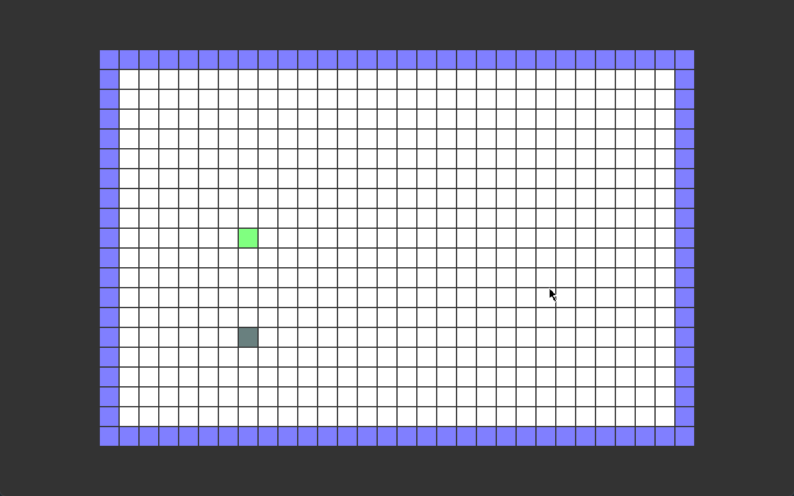

# Computer Graphics Project

## Snake Game

Classic snake game made in OpenGL.

---

## Libraries Used

- OpenGL
- GLFW (OpenGL windowing library)

--- 

## How to play

Run the snake.exe file. 

Use arrow keys (UP, DOWN, LEFT, RIGHT) to move the snake in the direction you want.

When the snake collides with an apple it's length increases by one unit.

In an event of a collision to the external wall or the snake's body, the game restarts.

 ---

## Gameplay

--- 

### Submitted by:
- Ayush Aryal (ACE076BCT021)
- Ayush Marhatta (ACE076BCT022)
- Ankit Khanal (ACE076BCT015)